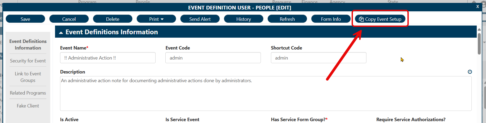

### What You Want to Do:
Duplicate the content of a form and make a new record. This is particularly helpful for creating a new version of an existing event: This script will make a new event with the exact settings as the original event, which can then be modified before saving to update the event name and form used.

### Code to Do It:
```javascript
const resolveAfterMs = (n) => new Promise((resolve, reject) => {
    if (!n || typeof n !== 'number') reject('No timeout specified.');
    setTimeout(() => resolve(), n);
});

const readFormLine = (fl) => {
    if (!fl) return;
    if (fl.typeCode == "FK") {
        return [fl.lutValue.value, fl.lutValue.description, fl.lutvalue?.prompt];
    } else if (fl.typeCode == "SF") {
        return fl.sfValue.filter(row => 
            row.formMode != "ADD" 
            && row.formMode != "DELETE" 
            && row.formMode != "NEW"
        ).map(row => Object.fromEntries(row.FormLines
            .map(fl => [fl.columnName, readFormLine(fl)])
            .filter(entry => 
                entry[1] !== null 
                && !(Array.isArray(entry[1]) 
                && entry[1].length < 1
            ))
        ));
    } else { return fl.value }
};

let newWin;
let frame;

const f1 = (n, handleEventName) => resolveAfterMs(n)
    .then(() => {
        if (!newWin.get_contentFrame().querySelector(".blockUI")) {
            // Continue if no blocks.
            frame = newWin.get_contentFrame().contentWindow;
            newWin.updateCell = (row, keyValuePair) => {
                // Find the column in the empty subform row to update
                let subformcell = row.FormLines.find(c => c.columnName == keyValuePair[0]);
                if (subformcell) {
                    let newValue = keyValuePair[1];
                    Array.isArray(newValue) 
                        ? subformcell.SetValue(...newValue) 
                        : subformcell.value = newValue;
                    subformcell.subFormHasData = true;

                    // Register subform as dirty to prompt myEvolv to save
                    DirtyFormField._defaultChangeDetector(subformcell);

                } else {
                    console.warn(`This subform does not contain a ${keyValuePair[0]} field!`);
                }
            };

            newWin.commitSubformChange = (subform, subformRow) => {
                subform.isDirty = true;
                subform.subFormHasData = true;
                subformRow.isDirty = true;
                subformRow.hasData = true;
                subformRow.subFormHasData = true;
            };

            newWin.insertIntoSubformJSONById = (formLineId, cellContents) => {
                // Get the subform element
                let subform = frame.Form.getFormLineById(formLineId);

                // Find the empty subform row at the end
                if (subform) {
                    let subformRow = subform.sfValue.find(row => 
                        !row.isDirty 
                        && row.keyValue?.slice(0, 3) === 'new' 
                        && row.keyValue?.length > 3
                    );
                    Object.entries(cellContents).forEach(entry => newWin.updateCell(subformRow, entry));
                    newWin.commitSubformChange(subform, subformRow);
                    subform.RefreshGrid();
                } else {
                    // Also return undefined if no subform found
                    console.warn(`No subform was found with the ID ${formLineId}`);
                    return;
                }
            };

            // Loop through form lines on the original form
            Form.formObject.FormLines
                .filter(fl => fl.columnName && fl.typeCode != 'RSF')
                .map(fl => ({ 
                    formLinesId: fl.formLinesId, 
                    typeCode: fl.typeCode, 
                    value: readFormLine(fl) 
                }))
                .filter(entry => 
                    entry[1] !== null 
                    && !(Array.isArray(entry[1]) 
                    && entry[1].length < 1
                ))
                .forEach(entry => {
                    if (entry.typeCode == 'SF') {
                        entry.value.forEach(i => newWin.insertIntoSubformJSONById(entry.formLinesId, i));
                    } else if (entry.typeCode == "FK") {
                        frame.Form.setFormElementById(entry.formLinesId, entry.value[0]);
                    } else {
                        frame.Form.setFormElementById(entry.formLinesId, entry.value);
                    }
                });

            // If any subform on the new form is a driving line subform, 
            // ensure that the box to enable the added rows is checked.
            frame.Form.getSubForms().forEach(sf =>
                frame.$($("iframe", sf.GetField()).prop("contentDocument"))
                    .find(`tr input.dirty`)
                    .closest('tr')
                    .find('input:not([id])')
                    .trigger("click")
            );

            if (handleEventName) {
                // New event name for event_definition (Doesn't do anything with an event_name column).
                const newEventName = `${getFormElement("event_name")} ${new Date().toISOString().slice(0, 10)}`;
                Form.setFormElement("event_name", newEventName);
    
                frame.Form.setFormElement("event_name", frame.getFormElement("event_name") + " - copy");
            }
        } else {
            // Keep waiting.
            f1(n, handleEventName);
        }
    })
    .catch(e => console.error(e));

const handleCopyForm = (handleEventName) => {
    newWin = openRadWindowEx(
        Form.formObject.formName || "Copy Form To New",
        `${window.location.origin}${window.location.pathname}$?form_header_id=${Form.formObject.formHeaderId}&parent_value=${parentValue}&key_value=&is_add_allowed=true&is_edit_allowed=true&is_delete_allowed=true&mode=ADD&isCompleteScheduledEvent=false#!`,
        {
            width: document.querySelector('body').clientWidth,
            height: document.querySelector('body').clientHeight,
            windowName: Form.formObject.formName || "Copy Form To New",
            useEvolvWindow: true,
        }
    );
    f1(1000, handleEventName);
};

handleCopyForm(false); // Or true, if you want to apply a date to event_name
```

### Implementation Details
1. Open the record you want to copy. This script was originally intended for user-defined event definitions, but can be applied to other types of records as needed.
2. Right-click the form and select **Inspect**.
3. Navigate to the Console tab in the Developer Tools pane and paste the above code into the tab.
4. Press **Enter**.
5. A new rad window should appear inside myEvolv *(not a new tab)*.
6. After a moment or two, the new form should populate with the information from the existing form.
7. Modify the new record as needed, and save the form.
8. *(Optional)* Make any necessary changes to the original record and save.

### Bonus Points
Instead of calling `handleCopyForm()` immediately using the console, you can **add the whole script above** (minus the last line) **to the After Load section of your form**. Then, **also** add the following script at the bottom to get a re-usable button in the top toolbar:
```javascript
// REPLACE handleCopyForm(false); from the script above with the code below:

// Toolbar Button (Optional)
const buttonText = 'Copy Event Setup'; // Change as desired
const $li = $('<li>').addClass('list-group-item form-toolbar-list-item');
const $a = $('<a>')
    .addClass('btn btn-default button-round')
    .text(buttonText)
    .attr({
        id: 'form-toolbar-999',
        mode: 'EDIT',
        href: '#',
        title: buttonText,
        role: 'button',
        'button-id': 'copyFormToNew'
    })
    // Pass true into handleCopyForm to also handle the event name.
    .on('click', () => handleCopyForm(false)); // Or true, if you want to apply a date to event_name
const $i = $('<i>').addClass('fa fa-copy').css('margin-right', '5px');
$a.prepend($i);
$li.append($a);
$('#formContentToolbarId').append($li);
```


### End-User Details
After saving, the new rad window should disappear like any other form in myEvolv.
