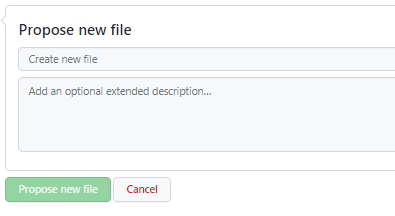

# myEvolv Code Repository

This repository contains code and code snippets submitted by the greater myEvolv community - JavaScript, SQL, etc. Anyone in the myEvolv community may reference code in this repository and/or submit new code examples. All submitted code will be reviewed by a group of volunteers from the myEvolv community, referred to as the Stewards. When creating an issue or a pull request, you may tag the Stewards using `@Stewards`.

Members of the myEvolv community are free to browse this code repository, but if they wish to contribute, a GitHub account is required. To contribute, follow the below guidelines.

**By your participation in this repository, you accept and will abide by the Terms of Use.**

***

## Terms of Use

1. :no_entry: Do not post any PHI
    - Self explanatory.
    - This includes screenshots.
    - **If a contribution you would like to make (a pull request) has PHI in it, do not submit the pull request. Once it's on GitHub, assume that it cannot be taken off and that it's visible to anyone on the internet.**
2. :no_entry: Do not post proprietary NetSmart content
    - :heavy_check_mark: Example of non-proprietary code:

    ```
    getFormElement('actual_date');
    ```
    - :x: Example of proprietary code:

    ```
    getFormElement = function(columnName) {
	    (... code that Netsmart wrote to define the getFormElement function ...)
    }
    ```
3. :handshake: Be nice! Be patient!
    - Community members who wish to **make contributions** are expected to follow guidelines to the best of their ability and **submit a pull request**, but they should not be expected to understand GitHub nearly as well as members of the Stewards.
    - If community members have **questions** about code on the repository, they should **submit an issue**. Questions about content on GitHub should be kept on GitHub. Contacting Steward members via any means other than communicating on GitHub is considered inappropriate and will result in a ban from participation.
4. :eye: When making contributions, format code in a way that a stranger five years from now will understand.
    - Use comments and follow the style guidelines
     * [Example: Google JavaScript Style Guide](https://google.github.io/styleguide/jsguide.html#formatting)
     * [Example: GitLab SQL Style Guide](https://about.gitlab.com/handbook/business-technology/data-team/platform/sql-style-guide/)
     * Each folder has a template markdown document for reference (e.g. `0-JavaScript Template.md`)
5. Do not assume that code contained in the repository will work.
    - All code submitted to the repository comes with the following disclaimer:

    > If the code you see here worked for someone else at some point in time, that does not mean it will work for you now. myEvolv is updated regularly thanks to the team at NetSmart. Functionality available in a prior version of myEvolv may not be available in a future version. **If you plan to use code from here, be sure to test it on your systems in a development environment before using it in production.**

## Guidelines for submitting code
If anyone wishes to submit new code to the repository, they should follow the below steps. In GitHub, each change to a repository is referred to as a "commit". A commit cannot be changed once it's made, so be sure your code is ready before you submit it.

1. Log into your GitHub account. You will need an account to make contributions to the repository.
2. Navigate to the location in the file system that you want your code to be stored.
3. Find the "Add file" button, then click "create new file"


4. You will be presented with a text editor of sorts. From there, you can:
    - Enter a name for your file (javascript files should end in ".js", SQL files should end in ".sql", and text / documentation files should end in ".md")
        - File endings determine the language and highlighting for the whole page. If you want to create a formatted page with code and images/descriptive text, end the file name with ".md" and use embedded code blocks
    - Type out or paste in your code.


5. Once your code is entered and formatted the way you want, add a commit title/subject line and an extended description.



-
    - "Create new file" is currently the default commit title. This is acceptable, but it's recommended to be a little more specific. A properly formed subject line should always be able to complete the following sentence: "If applied, this commit will <your subject line here>".
    - While a commit description is optional, it's highly recommended that you add it. Don't assume that your code is self-evident / self-explanatory!
6. When you're sure your commit is ready, hit the big green "Propose new file" button to notify the Stewards that you have a contribution to make!

***

## Current file structure (subject to change):

- README.md
- Form Design/
    - Exports/
    - Form Overview/
- How-To Guides/
    - assets/
        - images/
- JavaScript Functions/
- SQL Views/
    - assets/
        - images/
